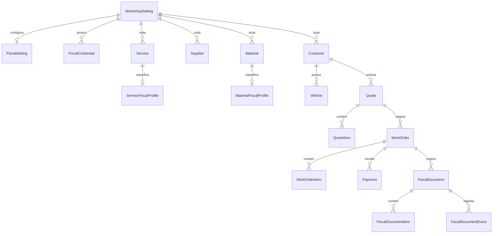

# Arquitetura fiscal do Revisô

## Objetivo

O módulo fiscal é uma extensão opcional da aplicação existente. Clientes, fornecedores, serviços, materiais, orçamentos, OS e pagamentos continuam únicos e funcionam sem configuração fiscal. Nenhuma regra tributária é específica de uma oficina no código.

O fluxo é:

```text
OPERAÇÃO → CLASSIFICAÇÃO → VALIDAÇÃO → DOCUMENTO FISCAL → PROVEDOR → AUTORIZAÇÃO
```

## Princípios

- `WorkOrder` permanece operacional e nunca é transformada em nota.
- `Payment` não dispara emissão automaticamente.
- `FiscalDocument` é genérico; inicialmente aceita apenas `NFSE`.
- Documentos guardam snapshots do prestador, tomador, configuração e itens.
- Dados autorizados não dependem da versão atual dos cadastros.
- Segredos não são persistidos nas entidades Base44.
- Toda escrita fiscal passa por `manageFiscal`, com usuário autenticado, administrador e oficina conferidos no servidor.
- Desativar o módulo bloqueia novas emissões, mas não exclui histórico.

## Entidades

### Existentes e evoluídas

- `WorkshopSetting`: cadastro operacional, endereço legado e novo endereço estruturado; contém somente a feature flag `fiscal_module_enabled`, não a tributação.
- `Customer`: cadastro único com PF/PJ/exterior e dados fiscais opcionais.
- `Supplier`: cadastro único equivalente ao cliente, preparado para compras futuras.
- `Material`: catálogo comercial; mantém campos antigos e recebe identificação/estoque adicionais.
- `Service`: catálogo comercial sem tributação embutida.
- `WorkOrderItem`: ganha unidade e tratamento fiscal explícito (`automatico`, `incluir`, `excluir`).

### Novas

- `FiscalSetting`: parâmetros gerais, padrões tributários, ambiente, provedor, modo de emissão e contato do contador.
- `ServiceFiscalProfile`: sobrescritas fiscais por serviço. Campos vazios herdam `FiscalSetting`.
- `MaterialFiscalProfile`: NCM, CEST e origem sem presumir CFOP/CST/CSOSN.
- `FiscalCredential`: somente referência segura, tipo, validade e status.
- `FiscalDocument`: estado, origem, totais, identificadores externos, snapshots e artefatos.
- `FiscalDocumentItem`: snapshot imutável dos itens fiscais.
- `FiscalDocumentEvent`: trilha append-only de criação, envio, autorização, erro, consulta, cancelamento e substituição.

## Relacionamentos



## Hierarquia de configuração de serviços

1. `FiscalSetting` define valores padrão da oficina.
2. `ServiceFiscalProfile` sobrescreve apenas o que for diferente.
3. Na prévia, o backend resolve o perfil efetivo.
4. Na criação do documento, o perfil resolvido é copiado para o snapshot do item.

## Estados

Configuração:

- `DISABLED`: módulo não contratado/habilitado.
- `INCOMPLETE`: habilitado, porém faltam dados ou provedor.
- `READY`: requisitos cadastrais mínimos e provedor configurados.
- `ERROR`: reservado para falhas de integração/configuração.

Documento:

- `DRAFT`, `VALIDATION_ERROR`, `READY`, `SENT`, `PROCESSING`, `AUTHORIZED`, `REJECTED`, `CANCELED`, `REPLACED`, `ERROR`.

## Validação

`manageFiscal` executa validação antes do provedor. Entre as verificações atuais:

- módulo habilitado e usuário administrador;
- OS finalizada e pertencente à oficina autenticada;
- prestador com CNPJ e endereço fiscal estruturado;
- inscrição municipal e regime tributário;
- tomador com CPF/CNPJ válido em formato básico;
- existência de itens de serviço não recusados/excluídos;
- código municipal e item da lista resolvidos por serviço;
- provedor e credencial segura configurados;
- inexistência de outro documento ativo para a mesma OS.

E-mail e endereço incompleto do tomador são avisos; requisitos legais finais devem ser ajustados após validação da contadora e do provedor.

## Provider

O contrato `FiscalProvider`, em `base44/shared/fiscalProvider.ts`, possui:

- `validate`
- `issue`
- `query`
- `cancel`
- `replace`
- `downloadXml`
- `downloadPdf`

O adaptador atual é deliberadamente não configurado e bloqueia chamadas externas. Um adaptador Nacional ou terceiro deverá retornar um resultado normalizado; payloads específicos não são salvos como modelo principal.

## Segurança

- Certificado, senha, token completo e chave privada ficam fora das entidades.
- `FiscalCredential.credential_reference` aponta para o segredo mantido no backend/cofre.
- As entidades documentais aceitam leitura da própria oficina, mas bloqueiam escrita direta.
- Configurações e perfis aceitam leitura administrativa; escrita direta é bloqueada.
- `manageFiscal` usa service role somente depois de validar usuário, papel e oficina.
- Erros retornados ao frontend são reduzidos e logs não incluem segredo/payload fiscal.

## Migração incremental

| Entidade/campo atual | Destino | Ação |
|---|---|---|
| `WorkshopSetting.address` | Mantido como legado | Manter; não tentar separar automaticamente texto livre. |
| Novo endereço estruturado da oficina | Campos em `WorkshopSetting` | Preencher progressivamente pela tela de configurações. |
| `Customer.name` | `Customer.name` | Manter compatibilidade. |
| `Customer.city/state` | Mesmos campos | Manter. |
| Dados fiscais adicionais do cliente | Novos campos opcionais | Preencher somente quando necessário. |
| `Supplier.name/fantasy_name` | Mesmos campos | Manter. |
| `Material.code/description/cost/stock` | Mesmos campos | Manter; novos aliases comerciais são opcionais. |
| `Service` | `Service` | Manter sem tributação embutida. |
| Tributação do serviço | `ServiceFiscalProfile` | Criar sob demanda; herdar padrões da oficina. |
| Tributação do material | `MaterialFiscalProfile` | Criar sob demanda, sem regra automática. |
| `WorkOrder`/`WorkOrderItem` | Mesmos registros | Manter IDs; usar como origem do documento. |
| `Payment`/`FinancialTransaction` | Mesmos registros | Manter separados da emissão. |

Nenhum dado legado é apagado. Endereços textuais não são convertidos automaticamente porque a separação de número, bairro e município não é confiável sem revisão humana.

## Pendências externas

- Definições tributárias e gatilho de emissão aprovados pela contadora.
- Escolha do provedor/API.
- Credenciais e certificado em ambiente seguro.
- Homologação de emissão, consulta, cancelamento e substituição.
- Política segura de armazenamento/compartilhamento de XML e PDF fiscal.

